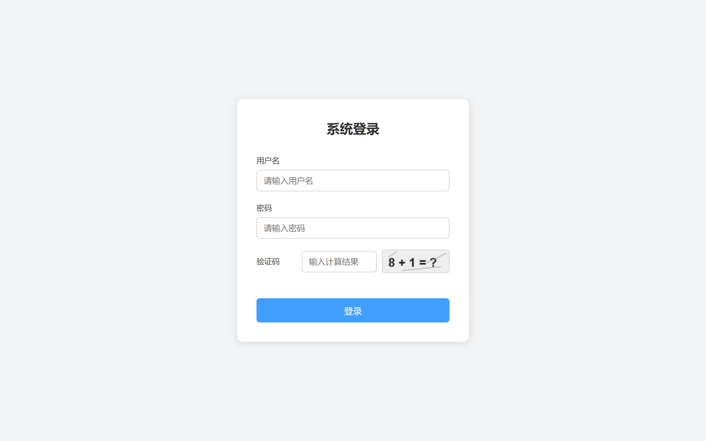
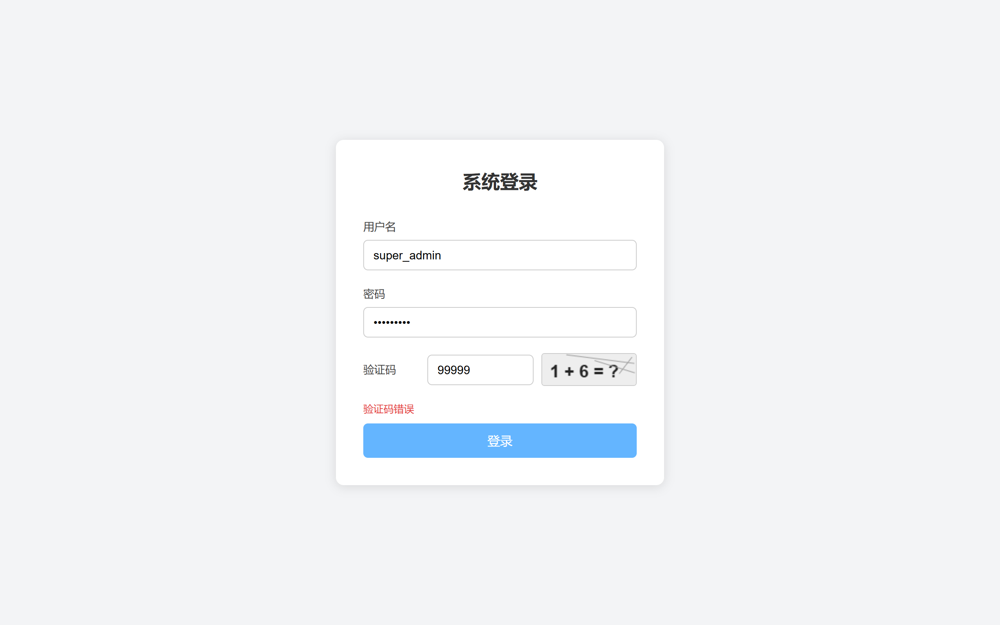
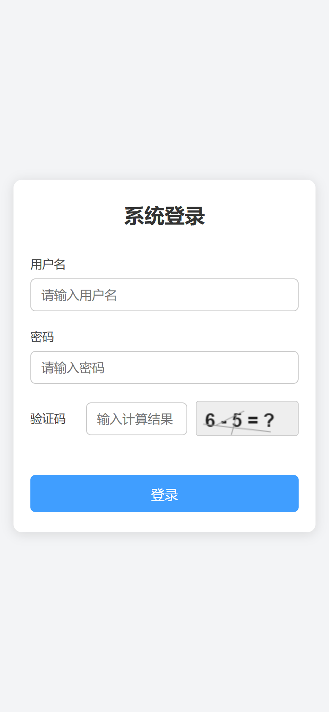

# 用户登录页面展示

一个基于 Vue 3 + Vite 的用户登录页面作业，包含用户名密码输入、算术验证码、前端表单校验与登录成功提示。

## 在线预览

**在线地址：待填写**

> 部署于 Cloudflare Pages，直接用浏览器打开即可查看，无需安装任何环境。
> 项目创建完成后，将上面一行替换为实际的 `xxx.pages.dev` 地址。

## 页面预览



| 表单校验提示 | 手机端适配 |
| --- | --- |
|  |  |

## 功能说明

- 用户名、密码、验证码非空校验
- 验证码为 10 以内的加减法，点击验证码可刷新
- 前端模拟账号：`super_admin` / `123456Ab.`
- 登录成功弹出提示
- 响应式布局，手机浏览器可正常访问

## 技术栈

- Vue 3（组合式 API，`<script setup>`）
- Vite
- 原生 Canvas 绘制验证码

## 项目结构

```text
sunwanqing/
  README.md
  docs/
    login-page.png
    login-error.png
    login-mobile.png
  vue-login-homework/
    src/
      Login.vue       # 登录页面组件
      App.vue         # 根组件
      main.js         # 应用入口
      style.css       # 全局样式
    public/
      favicon.svg
    index.html
    vite.config.js
    package.json
```

## 本地运行

```bash
cd vue-login-homework
npm install
npm run dev
```

构建生产版本：

```bash
npm run build
```

构建产物输出到 `vue-login-homework/dist`。
